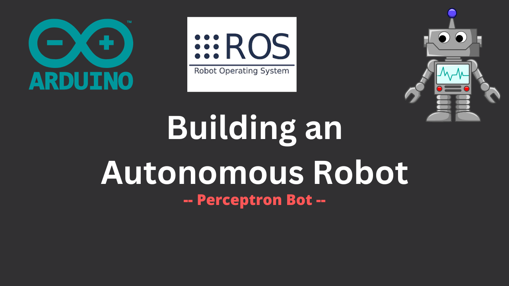

# Perceptron Bot: Your Path to Autonomous Robotics

**Welcome to the Perceptron Bot Repository!**

## Introduction

Discover the fascinating world of the Perceptron Bot, an ambitious project documented through an engaging YouTube series. This project serves as your comprehensive guide to building an autonomous robot from the ground up. At its heart, the Perceptron Bot acts as a versatile platform for assembling essential components such as LiDAR, onboard computing, and various sensors.

## Vision and Purpose

The Perceptron Bot isn't just a robot; it's a vision brought to life. The goal is to empower enthusiasts, whether novices or experts, with the tools and knowledge needed to create a differential robot capable of autonomous operations. The design of the Perceptron Bot emphasizes adaptability, making it an ideal canvas for integrating future enhancements and additional sensors.

## Repository Highlights

Within this repository, you'll find the core of the Perceptron Bot project:

- **Low-Level Drivers:** Essential low-level drivers are the backbone of the robot's functionality.
- **Setup Scripts:** Curated scripts expedite setup and streamline the integration of the Perceptron Workspace [`perceptron_ws`](https://github.com/PedroS235/perceptron_ws) – a ROS-driven workspace housing critical packages.
- **Documentation:** A set of guidelines and documentation to follow along.

## YouTube Series

The captivating YouTube series offers a holistic learning experience:

- **Design in 3D:** Craft an elegant chassis design through 3D modeling, merging aesthetics and functionality.
- **Delve into Low-Level Development:** Explore motor drivers and serial protocols, unraveling the mysteries of low-level robotics.
- **Simulation with Gazebo:** Immerse yourself in virtual simulation using Gazebo, refining your bot's behavior in diverse scenarios.
- **Master ROS2 and Navigation:** Elevate your coding skills with ROS2, culminating in the integration of the Navigation2 stack for autonomous navigation.

## Join the Community

Enthusiasts and developers are invited to contribute to the Perceptron Bot project:

1. **Fork this Repository:** Create a personal development space.
2. **Branch Out:** Develop your contributions in dedicated branches.
3. **Ignite Change:** Tackle issues, enhance features, and propose new ideas.
4. **Submit Pull Requests:** Initiate conversations about your contributions.

## License

The Perceptron Bot project is licensed under the `MIT` license, encouraging exploration, modification, and sharing within the global robotic community.

## Contact

For inquiries, insights, and collaboration, reach out to me at `pmbs.123@gmail.com`. Let's shape the future of autonomous robotics together.
